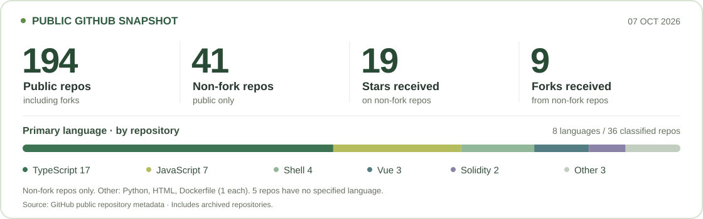

# Hi, I'm Alex — huaigu

I'm a **full-stack engineer focused on AI products and agent workflows**, with a background in Web3 and developer tools.

Much of my work lives outside public repositories, and my current AI projects are closed-source. I like turning ideas into useful software.

[Twitter / X · @coder_chao](https://x.com/coder_chao) · [Portfolio ↗](https://huaigu.github.io/)

## Award-winning work · Monad & Zama

| Project | Recognition |
| :--- | :--- |
| **[Neon Snake](https://github.com/huaigu/neon-snake-glitch-arena)** | **1st place** · Monad × Multisynq game-development competition · [Post](https://x.com/coder_chao/status/1940381550228721818) |
| **[ProofQuest](https://github.com/huaigu/proofquest-web3-adventures)** | **1st place** · Monad × PrismLab Hackathon |
| **[DCA-BOT](https://github.com/huaigu/DCA_FHE_BOT)** | **2nd place** · Zama Bounty Track |
| **[Number Verse Arena](https://github.com/huaigu/number-verse-arena)** | **Top 5** · Zama Developer Program |
| **[UpDown60](https://github.com/huaigu/UpDown60)** | **Winner** · Zama Builder Track, December 2025 · [Results](https://community.zama.org/t/zama-developer-program-december-2025-winners/4127) |

`AI agents` `TypeScript` `Python` `React` `Solidity` `FHE / ZK`

